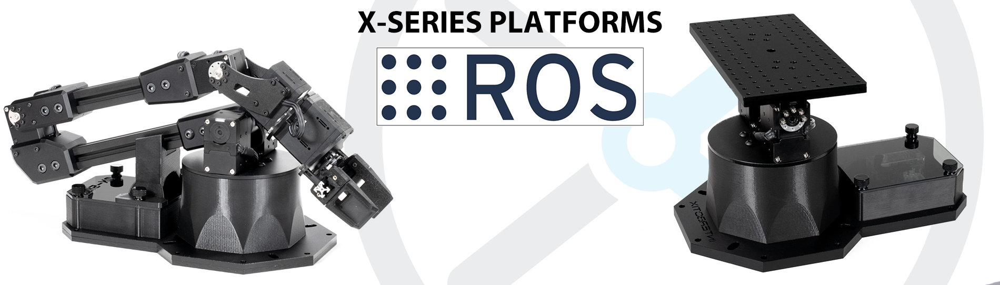

# InterbotiX X-Series Arm & Turret ROS Packages


NOTE: AS OF OCTOBER 29, 2020, THIS REPO IS IN LEGACY MODE!!!!!!

Check out the new and improved arm repo at https://github.com/Interbotix/interbotix_ros_manipulators or turret repo at https://github.com/Interbotix/interbotix_ros_turrets. No hardware changes are needed to use those repos. Please note that to work with the new code, you should either delete or rename your old *interbotix_ws* catkin workspace to something else. Also note, that if you are commanding arm (not turret) joint positions directly in your code (not by commanding an end-effector pose, but actually commanding a joint position directly), the positive direction of the 'elbow' and 'wrist_angle' joints have been inverted. This is to keep consistency in the ROS frames at each joint. So just flip the sign on those commands if needed in your custom ROS packages or python scripts.

## Overview
Welcome to the *interbotix_ros_arms* repo! This repository contains ROS packages meant to be used with the many [X-Series robotic arms](https://www.trossenrobotics.com/robotic-arms.aspx) and [X-Series Turrets](https://www.trossenrobotics.com/c/robot-turrets.aspx) sold by Trossen Robotics. Packages were tested on Ubuntu Linux 16.04 & 18.04 using ROS Kinetic and ROS Melodic respectively. Communication with the robot is done over USB via the [U2D2](https://www.trossenrobotics.com/dynamixel-u2d2.aspx). This device converts USB signals to TTL which allows a computer to 'talk' with each of the [Dynamixel servo motors](https://www.trossenrobotics.com/dynamixel-x-series-robot-servos) that make up each robot. For the most part, the ROS nodes were written in C++ with a couple nodes written in Python. However, any programming language capable of sending ROS messages can be used to control the robots. To that effect, the core packages that make up this repo are as follows:
- **interbotix_descriptions:** contains the meshes and URDFs (including accurate inertial models for the robot-arm links) for the arms and turrets
- **interbotix_sdk:** contains the driver node that controls the physical robot and publishes joint states.
- **interbotix_gazebo:** contains the config files necessary to launch a robot arm (not turret) model in Gazebo, including tuned PID gains for ros_control
- **interbotix_moveit:** contains the config files necessary to launch a robot arm (not turret) using MoveIt either in Gazebo or on the physical robot.

Finally, there is also an **interbotix_examples** directory containing various examples of how the above mentioned core packages can be used. While the majority of them demo how to work with the arms, the **interbotix_turret_control** package demos how to work with the turrets. So what are you waiting for? Let's get started!

## Requirements
Below is a list of the hardware you will need to get started:
- Computer running Ubuntu Linux 16.04 or 18.04 (with ROS already installed)
- An [X-Series robot kit](https://www.trossenrobotics.com/robot-kits.aspx) from Trossen Robotics that should include (among other things):
  - 1 x robotic arm or turret and accompanying 12V power supply
  - 1 x [U2D2](https://www.trossenrobotics.com/dynamixel-u2d2.aspx) and accompanying micro-usb cable
  - 1 x [X-Series power hub](http://www.support.interbotix.com/html/electronics/index.html#control-boards) to distribute power to the Dynamixel motors and allow communication with the U2D2

## Hardware Setup
There is not much required to get the robot ready to work as most of the setup is done for you. Just make sure to do the following steps:
1. Remove the robot from its packaging and place on a sturdy tabletop surface near an electrical outlet. To prevent the robot from potentially toppling during operation, secure it to a flat surface by placing the available thumb screws through the mounting holes around the base. At your own risk, you could also place a small heavy bean-bag on top of the acrylic plate by the base of the robot. Finally, make sure that there are no obstacles within the workspace of the arm or turret.
2. Plug the 12V power cable into an outlet and insert the barrel plug into the barrel jack on the X-series power hub (located under the see-through acrylic on the base of the robot). You should briefly see the LEDs on the Dynamixel motors flash red.
3. Plug in the micro-usb cable into the U2D2 (located under the see-through acrylic on the robot's base). Do NOT plug in the other side of the micro-usb cable into your computer just yet. Instead, follow the Quickstart directions below.

## Quickstart
1. Open a terminal on your computer and create a new catkin workspace called `interbotix_ws`
```
$ mkdir -p ~/interbotix_ws/src
$ cd ~/interbotix_ws/
$ catkin_make
```

2. Make sure that your new workspace is sourced every time a terminal is opened
```
$ source ~/interbotix_ws/devel/setup.bash
$ echo "source ~/interbotix_ws/devel/setup.bash" >> ~/.bashrc
```

3. Change into your `src` directory and clone the repository (install 'git' first). Make sure to change the branch to either 'kinetic' or 'melodic' based on your ROS distro.
```
$ cd ~/interbotix_ws/src
$ git clone https://github.com/Interbotix/interbotix_ros_arms.git
$ cd ~/interbotix_ws/src/interbotix_ros_arms
$ git checkout <distro>
```

4. Before doing another `catkin_make`, make sure that all required dependencies are installed. `rosdep` will be used to do this efficiently.
```
$ cd ~/interbotix_ws
$ rosdep update
$ rosdep install --from-paths src --ignore-src -r -y
```

5. There is one dependency that `rosdep` doesn't know about that must be installed manually. Known as [modern_robotics](https://github.com/NxRLab/ModernRobotics/tree/master/packages/Python), a robotic manipulation library created at Northwestern University, this API is used in the [interbotix_joy_control](interbotix_examples/interbotix_joy_control) example package and in the [Interbotix Python API](interbotix_sdk/src/interbotix_sdk/robot_manipulation.py) to perform inverse kinematics on the arm.
```
$ sudo apt install python-pip
$ sudo pip install modern_robotics
```

6. Now that all the dependencies are installed, it's time to build!
```
$ cd ~/interbotix_ws
$ catkin_make
$ source ~/.bashrc
```

7. Copy over the udev rules to the right directory. The rules create a symlink for the port to which the U2D2 is connected. This ensures that the computer always 'recognizes' the U2D2. It also reduces USB latency to 1 ms so that there is minimal lag during communication. Afterwards, reload and trigger the updated udev rules.
```
$ sudo cp ~/interbotix_ws/src/interbotix_ros_arms/interbotix_sdk/10-interbotix-udev.rules /etc/udev/rules.d
$ sudo udevadm control --reload-rules && udevadm trigger
```

8. Plug in the micro-usb cable (that should already be connected to the U2D2) to your computer and verify that the port shows up under the symlink `/dev/ttyDXL`
```
$ cd /dev
$ ls
```

9. Get familiar with the virtual robot model by launching it in Rviz and playing with the joint_state_publisher. Note that you must specify which robot model is being used as a command line argument. For example, the WidowX 200 robot arm can be launched as follows:
```
$ roslaunch interbotix_descriptions description.launch robot_name:=wx200 jnt_pub_gui:=true
```

10. Get familiar with the physical robot arm (let's say... a ViperX 250!) by executing the following command in the terminal (Cntrl-C from Step 9 first):
```
$ roslaunch interbotix_sdk arm_run.launch robot_name:=vx250
```
By default, all the motors in the robot are torqued on so it will be very difficult to manually manipulate it. To torque off the motors, execute the command below in another terminal. Be aware though that this will cause the robot to collapse so manually hold the arm or turret before executing it.
```
$ rosservice call /vx250/torque_joints_off
```
Now you should be able to freely manipulate the arm and gripper. Take note of how the Rviz model accurately mimics the real robot. To make the robot hold a certain pose, manually hold the robot in the desired pose and execute the following command:
```
$ rosservice call /vx250/torque_joints_on
```
You can now let go and observe how the arm stays in place.

11. For ROS Melodic users, open the following Gazebo config file to fix an issue described [here](https://bitbucket.org/osrf/gazebo/issues/2607/error-restcc-205-during-startup-gazebo).
```
$ nano ~/.ignition/fuel/config.yaml
```
Now change the url inside from `https://api.ignitionfuel.org` to `https://api.ignitionrobotics.org`.

That ends the quickstart tutorial. To get familiar with the architecture and launch file arguments, refer to the READMEs of the core packages. Start with the [interbotix_descriptions](interbotix_descriptions/) package, then the [interbotix_sdk](interbotix_sdk/) package, followed by the [interbotix_gazebo](interbotix_gazebo/) package and lastly the [interbotix_moveit](interbotix_moveit/) package. This is the most logical approach to take as each package builds on top of the previous packages (for the most part). Afterwards, feel free to check out the examples in the [interbotix_examples](interbotix_examples/) directory.

## Contributors
- [Matt Trossen](https://www.trossenrobotics.com/) - **Project Lead**
- [Solomon Wiznitzer](https://github.com/swiz23) - **ROS Engineer**
- [Levi Todes](https://github.com/LeTo37) - **CAD Engineer**
