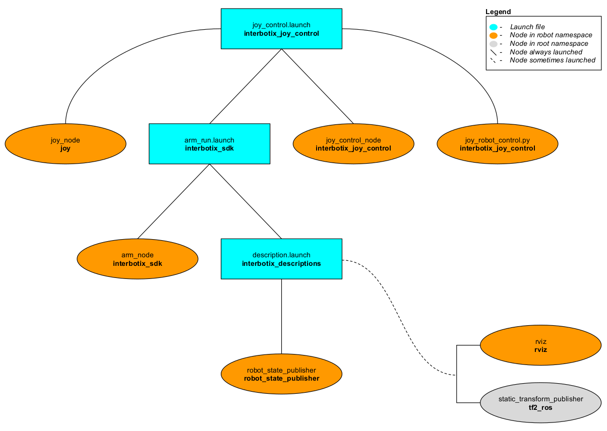

# interbotix_joy_control

## Overview
This package can be used to control the movements of any of the many X-series robotic arms using a SONY PS3/PS4 controller or Microsoft Xbox360 controller (untested) via Bluetooth. In this demo, the 'arm' joints are set to work in 'position' control mode while the gripper operates in 'PWM' mode. Refer to the joystick button map below to see how to operate the robot. Specifically, some of the joystick controls manipulate individual joints while others are used to perform 'inverse kinematics' on all the joints to get the end-effector of the robot (defined at 'ee_gripper_link') to move as if it's in Cartesian space. This is done using the [modern_robotics](https://github.com/NxRLab/ModernRobotics/tree/master/packages/Python) code library offered by Northwestern University.

## Structure

As shown above, the *interbotix_joy_control* package builds on top of the *interbotix_sdk* package. To get familiar with the nodes in the *interbotix_sdk* package, please look at its README. The other nodes are described below:
- **joy** - a ROS driver for a generic Linux joystick; it reads data from a SONY PS3 or PS4 controller joystick over Bluetooth and publishes  [sensor_msgs/Joy](http://docs.ros.org/melodic/api/sensor_msgs/html/msg/Joy.html) messages to the `joy` topic
- **joy_control_node** - responsible for reading in raw [sensor_msgs/Joy](http://docs.ros.org/melodic/api/sensor_msgs/html/msg/Joy.html) messages from the `joy` topic and converting them into [ArmJoyControl](msg/ArmJoyControl.msg) messages; this makes the code more readable and allows users to remap buttons very easily later.
- **joy_robot_control.py** - responsible for reading in [ArmJoyControl](msg/ArmJoyControl.msg) messages and sending joint and gripper commands to the *interbotix_sdk* node; while the 'waist' joint is directly controlled via the PS3/PS4 joystick, other buttons allow position-ik to be performed using all the arm joints.

## Bluetooth Setup
#### Sony PS4 Controller (Recommended)
Getting a PS4 controller connected via Bluetooth to a Linux laptop is pretty straightforward. Click the *Bluetooth* icon on the top right of your screen, followed by *Bluetooth Settings...*. Next, press and hold the *Share* button on the PS4 controller (see image below for reference). While holding the *Share* button, press and hold the *PS* button. After a few seconds, the triangular shaped LED located between the *L2* and *R2* buttons should start rapidly flashing white (about twice a second) at which point you can let go.

On the computer, click the '+' icon in the *Bluetooth* settings window. Wait until you see 'Wireless Controller' pop up, select it, and click *Next* on the bottom right of the window. A message should display saying 'successfully set up new device 'Wireless Controller'' and the LED should turn blue. This means the controller is connected to the computer. To disconnect, hold down the *PS* button for about 10 seconds until the LED turns off. To reconnect, just press the *PS* button (no need to hold it down). After blinking white a few times, the LED should turn blue.


##### Sony PS3 Controller
Getting a PS3 controller connected via Bluetooth to a Linux laptop can be a bit finicky at times. However, the commands below should do the trick. Get an original SONY PS3 controller, it's accompanying USB cable, and open up a terminal. Type:
```
$ sudo bluetoothctl
[bluetooth]# power on
[bluetooth]# agent on
[bluetooth]# scan on
```
Now, plug the PS3 controller into the Linux Laptop. At this point, a message should pop up in the terminal that looks something like the following (with a different MAC address):
```
[NEW] Device FC:62:B9:3F:79:E7 PLAYSTATION(R)3 Controller
```
When it appears, type:
```
[bluetooth]# trust <MAC-address>
```
Now unplug the PS3 controller and press the PS button. The four red LEDs at the front of the controller should flash a few times, eventually leaving just one LED on by the '1'. This means that the joystick paired successfully.

Sometimes, the joystick might cause the cursor of the computer mouse to go crazy. To fix this, add the following line to the `.bashrc` file:
```
alias joy_stop='xinput set-prop "PLAYSTATION(R)3 Controller" "Device Enabled" 0'
```
Now, whenver the PS3 joystick is paired to the computer, just type `joy_stop` in the terminal to stop it messing with the mouse (you're welcome).

## Usage
After pairing the joystick, type the following in a terminal (let's say to control the WidowX 200 arm):
```
roslaunch interbotix_joy_control joy_control.launch robot_name:=wx200
```
A red error message might appear in the screen saying `Couldn't open joystick force feedback!`. This is normal and will not affect the joystick operation. To further customize the launch file at run-time, look at the table below:

| Argument | Description | Default Value |
| -------- | ----------- | :-----------: |
| robot_name | name of a robot (ex. 'wx200') | "" |
| use_default_rviz | 'true' if Rviz should be displayed; 'false' otherwise | true |
| threshold | value from 0 to 1 defining joystick sensitivity; a larger number means the joystick should be less sensitive | 0.75 |
| controller | type of controller ('ps3', 'ps4', or 'xbox360') | ps4 |
| arm_run | 'true' if the *arm_run.launch* file should be launched - set to 'false' if you would like to run your own version of this file separately | true |

To understand how the joystick buttons map to controlling the robot, look at the diagram and table below. Note that while the Xbox360 has a slightly different naming convention, the button placement is essentially the same:


| Button | Action |
| ------ | ------ |
| START/OPTIONS | move robot arm to its Home pose |
| SELECT/SHARE | move robot arm to its Sleep pose |
| R2 | rotate the 'waist' joint clockwise |
| L2 | rotate the 'waist' joint counterclockwise |
| Triangle | increase gripper PWM in 25 step increments (max is 350) |
| X | decrease gripper PWM in 25 step increments (min is 150) |
| O | open gripper |
| Square | close gripper |
| D-pad Up | increase arm speed in 0.25 step increments (max is 3.00) |
| D-pad Down | decrease arm speed in 0.25 step increments (min is 1.00) |
| D-pad Left | 'Coarse' control - sets arm speed to a user-preset 'fast' speed |
| D-pad Right | 'Fine' control - sets arm speed to a user-preset 'slow' speed |
| Right stick Up/Down | Increase/Decrease pitch of the end-effector |
| Right stick Left/Right | Increase/Decrease roll of the end-effector |
| R3 | reverses the Right stick Left/Right control |
| Left stick Up/Down | move the end-effector (defined at 'ee_gripper_link') vertically in Cartesian space |
| Left stick Left/Right | move the end-effector (defined at 'ee_gripper_link') horizontally in Cartesian space |
| L3 | reverses the Left stick Left/Right control |
