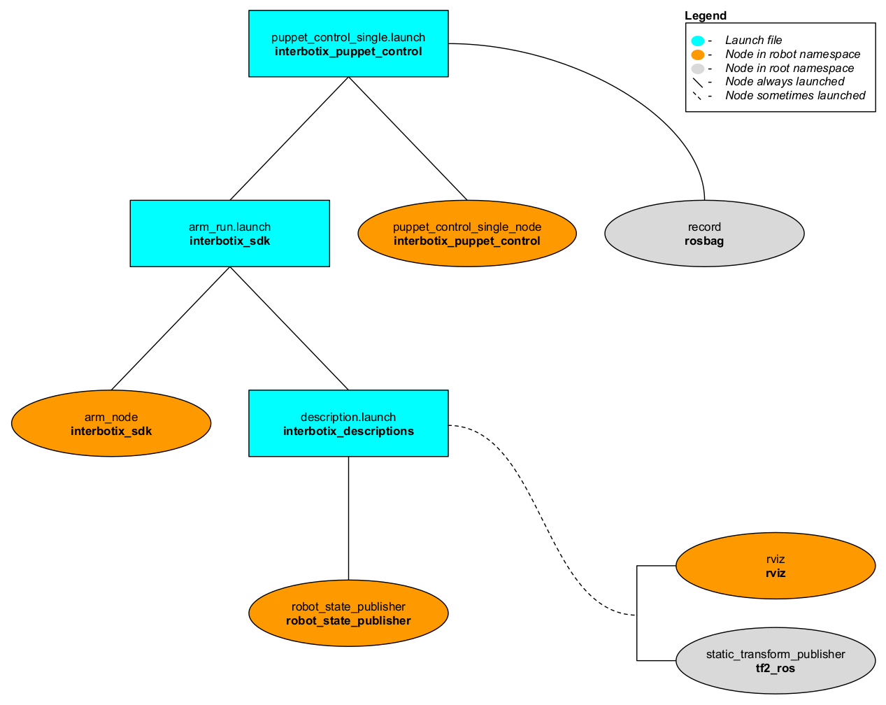
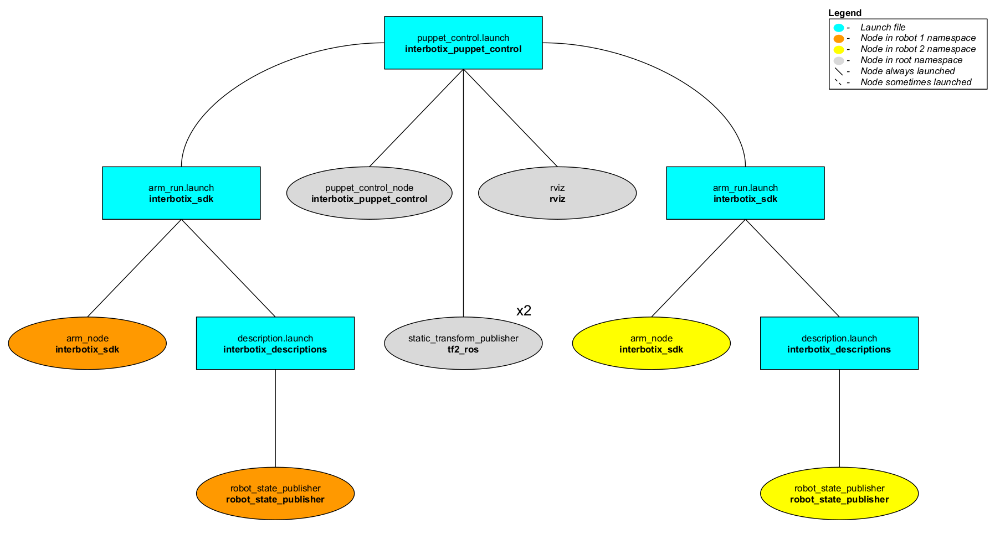

# interbotix_puppet_control

## Overview
This package demos two similar features that the Interbotix arms support. Imagine that you would like to have the robot arm perform some motions to achieve a specific task. One way of doing this would be to create a [JointTrajectory](http://docs.ros.org/melodic/api/trajectory_msgs/html/msg/JointTrajectory.html) of desired joint positions at specific times which you could then command the robot. Alternatively (and much less time consuming), you could manually manipulate the arm to do the specific motions and record them in a ROS bag file. Then, you could 'play back' the bag file as many times as you like to repeat the motions on the same robot later. This 'record/playback' feature is made possible by the **puppet_control_single_node**.

Now imagine that you have two (or more) Interbotix arms of the same type. What the **puppet_control_node** allows you to do is to manually manipulate one of the arms and watch as the motion is repeated in real time on the second robot. A potential application of this could be a warehousing environment. Instead of a worker straining his back to lift a heavy package, he could manually manipulate a small version of a robotic arm to maneuver an industrial-sized arm to pick it up.
## Structure
As shown below, the *interbotix_puppet_control* package builds on top of the *interbotix_sdk* package. To get familiar with the nodes in the *interbotix_sdk* package, please look at its README. The nodes specific to this package are described below.



The above diagram shows the structure for the 'record/playback' feature. The two nodes involved are:
- **puppet_control_single_node** - responsible for reading the arm's current joint states and publishing them as position commands to the `/<robot_name>/joint/commands` and `/<robot_name>/gripper/command` topics. Conveniently, as the arm is torqued off so that the user can manipulate it, the joints will not act upon these commands
- **record** - responsible for recording the two topics mentioned above so that they can be played back later



The above diagram shows the structure for the 'puppet control' feature. The nodes involved are:
- **puppet_control_node** - responsible for reading the current joint states from one arm and then publishing them as position commands to a second arm; it accepts two robot names as parameters - `robot_name_1` and `robot_name_2`
- **static_transform_publisher** - two of these nodes are launched to specify the position of both arms relative to the Rviz 'world' frame
- **rviz** - only launch one instance of Rviz with two RobotModels for the two robot arms

## Usage
### Record/Playback
To run this feature on a single robot (let's say the PincherX 150), type the following in a terminal:
```
roslaunch interbotix_puppet_control puppet_control_single.launch robot_name:=px150
```
Once the nodes finish launching, manually manipulate the arm and gripper through your desired motions. When done, 'Cntrl-C' the nodes so that *rosbag* stops recording. By default, the bag-file will be saved in the [bag](bag/) directory. To playback the motion, launch the *interbotix_sdk* node with the arm and gripper in 'position' control mode (which should be the default) with profile velocities and accelerations of '0' (default for gripper). By setting these arguments to '0', you're allowing the motors to be their most reactive so that commands are followed as closely as possible.
```
roslaunch interbotix_sdk arm_run.launch robot_name:=px150 arm_profile_velocity:=0 arm_profile_acceleration:=0
```
Next, navigate to the directory where your bag-file is located and in a terminal, type:
```
rosbag play px150_commands.bag
```
The robot should now repeat the motions. To play the motion again, just re-enter the above command. When done, 'Cntrl-C' to stop all nodes. To see other command line arguments for the 'puppet_control_single.launch' file, refer to the table below.

| Argument | Description | Default Value |
| -------- | ----------- | :-----------: |
| robot_name | name of a robot (ex. 'wx200') | "" |
| bag_name | Desired ROS bag file name | $(arg robot_name)_commands |
| arm_run | 'true' if the *arm_run.launch* file should be launched - set to 'false' if you would like to run your own version of this file separately | true |

### Puppet Control
To run this feature, plug two of the same type of robots (ex. the WidowX 250) into two USB ports and in a terminal, type:
```
roslaunch interbotix_puppet_control puppet_control.launch robot_model_1:=wx250 robot_model_2:=wx250
```
It might be good idea to verify which robot is given `ttyUSB0` as its port name so that you know which robot should be manually manipulated. Do this by only plugging one robot into your computer and looking at the name in the `/dev` directory before plugging in the second one. Next, manually manipulate the first arm and observe how the second arm closely mimics the motion! To see other command line arguments for the 'puppet_control.launch' file, refer to the table below.

| Argument | Description | Default Value |
| -------- | ----------- | :-----------: |
| robot_model_1 | model type of the first robot arm | "" |
| port_1 | USB port to which the first robot is connected | /dev/ttyUSB0 |
| robot_model_2 | model type of the second robot arm | "" |
| port_2 | USB port to which the second robot is connected | /dev/ttyUSB1 |
| rvizconfig | Rviz configuration file to visualize two robots | reference [puppet_control.launch](launch/puppet_control.launch) |
| arm_run | 'true' if the *arm_run.launch* file should be launched - set to 'false' if you would like to run your own version of this file separately | true |

## Notes
There are two bag files in the [bag](bag/) directory. Both of these were created using the 'record/playback' feature with the WidowX 200 arm. See if you can figure out what they do! As a hint, one of them involves [rubber ducks](https://www.amazon.com/Kangaroos-Rubber-Duck-Assortment-100-Pack/dp/B07JWF7X4F/ref=sr_1_4?keywords=small+rubber+ducks&qid=1571336224&sr=8-4).
