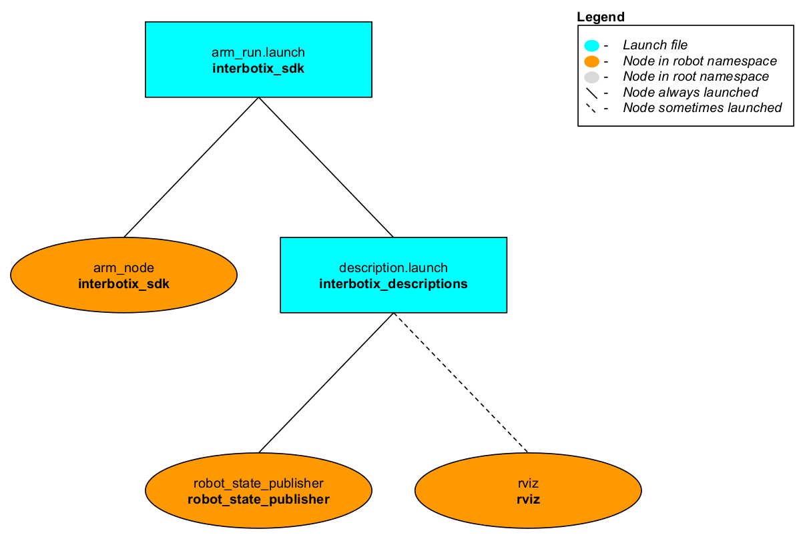

# interbotix_sdk

## Overview
This package contains the actual driver node responsible for controlling the many Interbotix X-Series arms and turrets sold by Trossen Robotics. It is loosely based on the [dynamixel_workbench_controllers.cpp](https://github.com/ROBOTIS-GIT/dynamixel-workbench/blob/master/dynamixel_workbench_controllers/src/dynamixel_workbench_controllers.cpp) file created by [ROBOTIS](http://www.robotis.us/) to control a slew of their Dynamixel servo motors. Also written in C++, the node presents a ROS interface that is built on top of the [dynamixel_workbench_toolbox](https://github.com/ROBOTIS-GIT/dynamixel-workbench/tree/master/dynamixel_workbench_toolbox), a C++ library provided by ROBOTIS containing useful functions that utillize their communication protocol. Feel free to take a look at their [API](http://emanual.robotis.com/docs/en/software/dynamixel/dynamixel_workbench/#api-references) to get a better understanding of how their functions work. Also, take a look at the *interbotix_sdk*'s header file [here](include/interbotix_sdk/arm_obj.h) which contains the various ROS Publishers, Subscribers, Timers, etc... all fully documented. In general, there are two ways this node can be used. One is to command the robot via the ROS topics and/or services. In this manner, the developer can code in any language that is capable of sending a ROS message. The other approach is to 'skip' the ROS topic layer and use the publicly available functions directly. All the user would need to do is create an instance of the 'RobotArm' class as shown [here](src/arm_node.cpp) to take advantage of these functions.

Besides for the directories typically found in a ROS package, there is also a [config](config/) directory containing YAML files. Each file contains register values that need to be written to each of the Dynamixel motors that make up an robot so that it runs properly. To get familiar with the various registers on a motor, take a look [here](http://emanual.robotis.com/docs/en/dxl/x/xm430-w350/#control-table-of-eeprom-area) to see them for the XM430-W350 motor.

## Structure


As shown in the image above, the *interbotix_sdk* package builds on top of the *interbotix_descriptions* package. To get familiar with the nodes not described below, just hop over to the ROS package in this repo that launches them. In total, the *interbotix_sdk* only launches one node called **arm_node**. As mentioned previously, this node is responsible for controlling the physical robot. Please look below for a description of the ROS topics, services, actions, and parameters available to the user.

##### Publishers
- `/<robot_name>/joint_states` - publishes ROS JointState messages at 100 Hz; note that in general, positions are given in radians, velocities are given in radians per second, and effort is given in milliamps. If the gripper is being used, the positions for the 'right_finger' and 'left_finger' joints are given in meters relative to a virtual 'fingers_link' placed dead center (launch a robot model in Rviz to get familiar with the link and joint names/positions).

##### Subscribers
- `/<robot_name>/joint/commands` - subscribes to [JointCommands](msg/JointCommands.msg) messages; this topic is used to control a specified group of joints synchronously (which is more efficient than sending commands to individual joints consecutively). Refer to the message description for implementation details. This 'group of joints' can be defined in the 'order' sequence in a motor config file ('gripper' joint excluded if present).
- `/<robot_name>/gripper/command` - subscribes to ROS [Float64](http://docs.ros.org/melodic/api/std_msgs/html/msg/Float64.html) messages to control the gripper joint (if present). Refer to the 'arm_write_gripper_command' function in the [header file](include/interbotix_sdk/arm_obj.h) for implementation details.
- `/<robot_name>/single_joint/command` - subscribes to [SingleCommand](msg/SingleCommand.msg) messages; this topic is used to control a single joint. Refer to the message description for implementation details.
- `/<robot_name>/arm_controller/joint_trajectory` - subscribes to ROS [JointTrajectory](http://docs.ros.org/melodic/api/trajectory_msgs/html/msg/JointTrajectory.html) messages; this topic is used to send desired trajectories to a specified group of joints. Refer to the 'arm_joint_trajectory_msg_callback' function in the [header file](include/interbotix_sdk/arm_obj.h) for implementation details.
- `/<robot_name>/gripper_controller/gripper_trajectory` - subscribes to ROS [JointTrajectory](http://docs.ros.org/melodic/api/trajectory_msgs/html/msg/JointTrajectory.html) messages; this topic is used to send desired trajectories to the gripper. Refer to the 'arm_gripper_trajectory_msg_callback' function in the [header file](include/interbotix_sdk/arm_obj.h) for implementation details.

##### Services
- `/<robot_name>/torque_joints_on` - service to torque on all motors (including gripper)
- `/<robot_name>/torque_joints_off` - service to torque off all motors (including gripper)
- `/<robot_name>/get_robot_info` - service to get robot information like joint limits, joint names, and a couple preset robot poses; refer to [RobotInfo.srv](srv/RobotInfo.srv) for implementation details.
- `/<robot_name>/set_operating_modes` - service to set firmware operating modes (like position, velocity, current, etc...) for a robot's joints; refer to [OperatingModes.srv](srv/OperatingModes.srv) for implementation details. Note that the motors will torque off for a moment when changing operating modes so make sure that the robot is in its 'sleep' pose (defined in the motor config file) before calling this service.
- `/<robot_name>/set_firmware_pid_gains` - service to set the PID gains for position/velocity control in the motor firmware; refer to [FirmwareGains.srv](srv/FirmwareGains.srv) for implementation details.
- `/<robot_name>/set_motor_register_values` - service to set multiple motor register values at once for a user-provided register name; refer to [RegisterValues.srv](srv/RegisterValues.srv) for implementation details.
- `/<robot_name>/get_motor_register_values` - service to get multiple motor register values at once for a user-provided register name; refer to [RegisterValues.srv](srv/RegisterValues.srv) for implementation details.

##### Actions
- `/<robot_name>/arm_controller/follow_joint_trajectory` - Action server that takes in ROS [FollowJointTrajectoryAction](http://docs.ros.org/electric/api/control_msgs/html/msg/FollowJointTrajectoryAction.html) messages to control the trajectory of a robot's arm joints (excluding gripper). It is used with MoveIt and allows for either "position" or "velocity" trajectory control. It can be preempted by MoveIt and works using the 'time_from_start' fields in the trajectory messages.
- `/<robot_name>/gripper_controller/follow_joint_trajectory` - Action server that takes in ROS [FollowJointTrajectoryAction](http://docs.ros.org/electric/api/control_msgs/html/msg/FollowJointTrajectoryAction.html) messages to control the trajectory of the gripper joint. It is used with MoveIt and allows for "position" trajectory control. It can be preempted by MoveIt or itself if it is exerting too much effort. Additionally, it works using the 'time_from_start' fields in the trajectory messages.

##### Parameters
- `robot_name` - typically, the name of a robot as defined by the filename of a motor config file; however, a user can give a custom name to their robot as well.
- `robot_model` - typically, this will be the same as `robot_name`; however, if `robot_name` is not just the name of the robot, then `robot_model` describes the model type (ex. 'wx200' if the `robot_name` is 'arm1/wx200'); it is used to load the right motor config file from the 'config' directory
- `motor_configs` - the file path to the 'motor config' directory.
- `port` - the USB port to which the robot is connected.
- `default_gripper_bar` - if this is true and 'default_gripper_fingers' is true, then the joint states of the 'right_finger_link' and 'left_finger_link' are published in the joint_states topic.
- `default_gripper_fingers` - if this is true and 'default_gripper_bar' is true, then the joint states of the 'right_finger_link' and 'left_finger_link' are published in the joint_states topic.
- `arm_operating_mode` - desired operating mode for a specified group of joints; this can be "position", "velocity", "pwm", "current", or "none". Note that only the ViperX robots support "current" control.
- `arm_profile_velocity` - acts as a pass-through to the [Profile_Velocity](http://emanual.robotis.com/docs/en/dxl/x/xm430-w350/#profile-velocity112) register and operates in one of two ways. If `use_time_based_profile` is set to 'false', this parameter describes the max velocity limit for a specified group of joints; for example, if doing 'position' control, setting this to '131' would be equivalent to a limit of 3.14 rad/s; if `use_time_based_profile` is set to 'true', this parameter sets the time span (in milliseconds) that it should take for a specified group of joints to move; to have an 'infinite' max limit, set to '0'.
- `arm_profile_acceleration` - acts as a pass-through to the [Profile_Acceleration](http://emanual.robotis.com/docs/en/dxl/x/xm430-w350/#profile-acceleration108) register and operates in one of two ways. If `use_time_based_profile` is set to 'false', this parameter describes the max acceleration limit for a specified group of joints; for example, if doing 'position' or 'velocity' control, setting this to '15' would be equivalent to a limit of 5.6 rad/s^2; if `use_time_based_profile` is set to 'true', this parameter sets the time span (in milliseconds) that it should take for a specified group of joints to accelerate; to have an 'infinite' max limit, set to '0'.
- `gripper_operating_mode` - desired operating mode for the gripper. This can be "position", "ext_position" "velocity", "pwm", "current", or "none". Note that only the ViperX robots support "current" control. Also, "ext_position" is equivalent to "position" control but allows multiple rotations. Only use this with a custom gripper that can do more than one revolution.
- `gripper_profile_velocity` - works exactly the same as `arm_profile_velocity` but only for the gripper joint
- `gripper_profile_acceleration` - works exactly the same as `arm_profile_acceleration` but only for the gripper joint
- `use_moveit` - if true, this node starts the FollowJointTrajectory action servers for a specified group of joints and gripper joint; set this to true if MoveIt is being used.
- `use_pid_cntlrs` - if true, this node inserts PID controllers between a commanded joint trajectory and the physical motors. Default pid configs for each robot can be found in the `pid_config` directory. For better control, feel free to modify the gains as necessary. See one of the files for setup instructions and an explanation of how the controllers work. Note that if this parameter is true, then `arm_operating_mode` must be set to 'velocity' control as well.
- `use_time_based_profile` - can be 'true' or 'false'. Refer to the `arm_profile_velocity` and `arm_profile_acceleration` parameters for details.

## Usage

##### Interbotix Arm
To run this package on an arm (not a turret), type the line below in a terminal (assuming the PincherX 150 is being launched)
```
$ roslaunch interbotix_sdk arm_run.launch robot_name:=px150
```
This is the bare minimum needed to get up and running. Take a look at the table below to see how to further customize with other launch file arguments.

| Argument | Description | Default Value |
| -------- | ----------- | :-----------: |
| robot_name | name of a robot (ex. 'arm1/wx200' or 'wx200') | "" |
| robot_model | only used when launching multiple robots or if `robot_name` contains something other than the model type; if that's the case, this should be set to the robot model type (ex. 'wx200') | '$(arg robot_name)' |
| port | the USB port to which the robot is connected | /dev/ttyDXL |
| use_default_gripper_bar | if true, the gripper_bar link is also loaded to the 'robot_description' parameter; if false, the gripper_bar link and any other link past it in the kinematic chain is not loaded to the parameter server. Set to 'false' if you have a custom gripper attachment | true |
| use_default_gripper_fingers | if true, the gripper fingers are also loaded to the 'robot_description' parameter; if false, the gripper fingers and any other link past it in the kinematic chain is not loaded to the parameter server. Set to 'false' if you have custom gripper fingers | true |
| arm_operating_mode | desired operating mode for the robot joints (excluding gripper); this can be "position", "velocity", "pwm", "current", or "none". Note that only the ViperX robots support "current" control | position |
| arm_profile_velocity | register value describing the max velocity limit for the robot joints (excluding gripper); refer to the register description [here](http://emanual.robotis.com/docs/en/dxl/x/xm430-w350/#profile-velocity112). If doing 'position' control, setting this to '131' would be equivalent to a limit of 3.14 rad/s. To have an 'infinite' max limit, set this to '0' | 131 |
| arm_profile_acceleration | register value describing the max acceleration limit for the robot joints (excluding gripper); refer to the register description [here](http://emanual.robotis.com/docs/en/dxl/x/xm430-w350/#profile-acceleration108). If doing 'position' or 'velocity' control, setting this to '15' seems to give smooth but quick movement. To get very fast motion, set this to '0' | 15 |
| gripper_operating_mode | desired operating mode for the gripper. This can be "position", "ext_position" "velocity", "pwm", "current", or "none". Note that only the ViperX robots support "current" control. Also, "ext_position" is equivalent to "position" control but allows multiple rotations. Only use this with a custom gripper that can do more than one revolution | position |
| gripper_profile_velocity | sets the max velocity limit for the gripper joint; refer to 'arm_profile_velocity' above | 0 |
| gripper_profile_acceleration | sets the max acceleration limit for the gripper joint; refer to 'arm_profile_acceleration' above | 0 |
| use_moveit | set this to 'true' if MoveIt is being used; it loads the FollowJointTrajectory Action servers for the arm and gripper | false |
| use_pid_cntlrs | set this to 'true' if you are commanding trajectories to the arm joints (via MoveIt or the trajectory topic) and would like to run PID controllers to make the motors better track the desired states. Refer to any file in the [pid_config](pid_config/) directory for a deeper explanation. Note that the 'arm_operating_mode' must be set to 'velocity' for this to work | false |
| use_time_based_profile | set this to 'true' to do 'time' based control or set to 'false' to do 'velocity' based control (refer to parameter description above) | false |
| use_world_frame | set this to 'true' if you would like to load a 'world' frame to the 'robot_description' parameter which is located exactly at the 'base_link' frame of the robot; if using multiple robots or if you would like to attach the 'base_link' frame of the robot to a different frame, set this to False | true |
| external_urdf_loc | the file path to the custom urdf.xacro file that you would like to include in the Interbotix robot's urdf.xacro file| "" |
| use_default_rviz | launches the rviz and static_transform_publisher nodes | true |

##### Interbotix Turret

To run this package on a turret, type the line below in a terminal (assuming the PhantomX XL430 is being launched)
```
$ roslaunch interbotix_sdk turret_run.launch robot_name:=pxxls
```
This is the bare minimum needed to get up and running. Take a look at the table below to see how to further customize with other launch file arguments.

| Argument | Description | Default Value |
| -------- | ----------- | :-----------: |
| robot_name | name of a robot (ex. 'turret1/wxxmd' or 'wxxmd') | "" |
| robot_model | only used when launching multiple robots or if `robot_name` contains more than the model type; if that's the case, this should be set to the robot model type (ex. 'wxxmd'); `robot_name` should then be set to a unique name followed by '$(arg robot_model)' - such as 'turret1/wxxmd' | '$(arg robot_name)' |
| port | the USB port to which the robot is connected | /dev/ttyDXL |
| turret_operating_mode | desired operating mode for the turret joints; this can be "position", "velocity", "pwm", "current", or "none"; note that the PhantomX turret does not support "current" control | position |
| turret_profile_velocity | register value describing the time span that it should take for the joints to move; refer to the register description [here](http://emanual.robotis.com/docs/en/dxl/x/xm430-w350/#profile-velocity112); if doing 'position' control, setting this to '1000' would mean it would take 1000 ms for the turret to get to the desired position. to have an 'infinite' max limit, set this to '0' | 0 |
| turret_profile_acceleration | register value describing the time span it should take for the joints to accelerate; refer to the register description [here](http://emanual.robotis.com/docs/en/dxl/x/xm430-w350/#profile-acceleration108); if doing 'velocity' control, setting this to 100 would mean it would take 100 ms for the turret joints to get to their desired velocity; to get very fast motion, set this to '0'. | 0 |
| use_time_based_profile | set this to 'true' to do 'time' based control or set to 'false' to do 'velocity' based control (refer to parameter description above) | true |
| use_world_frame | set this to 'true' if you would like to load a 'world' frame to the 'robot_description' parameter which is located exactly at the 'base_link' frame of the robot; if using multiple robots or if you would like to attach the 'base_link' frame of the robot to a different frame, set this to False | true |
| external_urdf_loc | the file path to the custom urdf.xacro file that you would like to include in the Interbotix robot's urdf.xacro file| "" |
| use_default_rviz | launches the rviz and static_transform_publisher nodes | true |

## Troubleshooting Notes
Please note that the node does NOT check joint limits. It is up to the user to make sure that the joint limits are not violated. That said, if a motor experiences a load too much for it, it should error out - resulting in the motor torquing off. It is easy to tell if a motor is in an error state since its LED will be flashing red. In this case, unplug and replug the power cable into the robot which should reset the motor.

Also, the user should verify before launching any nodes that the 'waist' or 'pan' joint of the arm/turret is within its joint limit (+/- 180 degrees). If it's unclear which direction the arm should be rotated, try to manually rotate the arm so that it is resting in its cradle. If there is too much tension, most likely the arm must be rotated the other way. Another method to verify this is to carefully peak under the base of the robot to look at the cable winding from the 'waist' or 'pan' motor to the 'shoulder' or 'tilt' motor(s). If the cable looks taut, rotate the robot in the direction that appears to make it looser.

Finally, if doing position control, it might be a good idea to use the `set_firmware_pid_gains` ROS service available from the *interbotix_sdk* to raise the **Position_I_Gain** register to 100 (or thereabouts). By default this register's value is 0 so it is very likely that without doing this, the robot will not exactly achieve a desired goal pose (due to gravity or friction).
