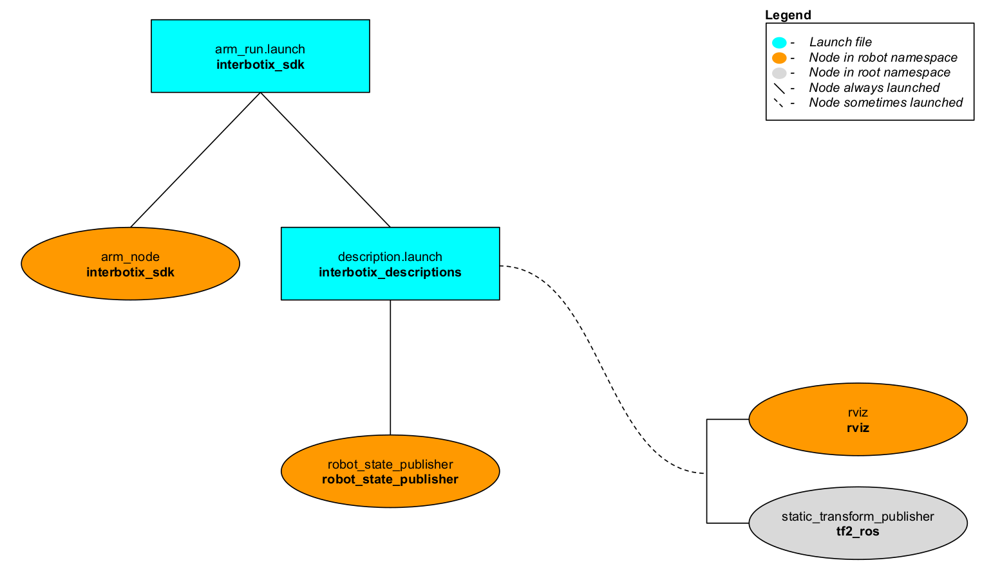

# interbotix_sdk

## Overview
This package contains the actual driver node responsible for controlling any of the eight Interbotix X-Series arms sold by Trossen Robotics. It is loosely based on the [dynamixel_workbench_controllers.cpp](https://github.com/ROBOTIS-GIT/dynamixel-workbench/blob/master/dynamixel_workbench_controllers/src/dynamixel_workbench_controllers.cpp) file created by [ROBOTIS](http://www.robotis.us/) to control a slew of their Dynamixel servo motors. Also written in C++, the node presents a ROS interface that is built on top of the [dynamixel_workbench_toolbox](https://github.com/ROBOTIS-GIT/dynamixel-workbench/tree/master/dynamixel_workbench_toolbox), a C++ library provided by ROBOTIS containing useful functions that utillize their communication protocol. Feel free to take a look at their [API](http://emanual.robotis.com/docs/en/software/dynamixel/dynamixel_workbench/#api-references) to get a better understanding of how their functions work. Also, take a look at the *interbotix_sdk*'s header file [here](include/interbotix_sdk/arm_obj.h) which contains the various ROS Publishers, Subscribers, Timers, etc... all fully documented. In general, there are two ways this node can be used. One is to command the robot arm via the ROS topics and/or services. In this manner, the developer can code in any language that is capable of sending a ROS message. The other approach is to 'skip' the ROS topic layer and use the publicly available functions directly. All the user would need to do is create an instance of the 'RobotArm' class as shown [here](src/arm_node.cpp) to take advantage of these functions.

Besides for the directories typically found in a ROS package, there is also a [config](config/) directory containing eight YAML files. Each file contains register values that need to be written to each of the Dynamixel motors that make up an arm so that it runs properly. To get familiar with the various registers on a motor, take a look [here](http://emanual.robotis.com/docs/en/dxl/x/xm430-w350/#control-table-of-eeprom-area) to see them for the XM430-W350 motor.

## Structure


As shown in the image above, the *interbotix_sdk* package builds on top of the *interbotix_descriptions* package. To get familiar with the nodes not described below, just hop over to the ROS package in this repo that launches them. In total, the *interbotix_sdk* only launches one node called **arm_node**. As mentioned previously, this node is responsible for controlling the physical robot arm. Please look below for a description of the ROS topics, services, actions, and parameters available to the user.

##### Publishers
- `/<robot_name>/joint_states` - publishes ROS JointState messages at 100 Hz; note that in general, positions are given in radians, velocities are given in radians per second, and effort is given in milliamps. If the gripper is being used, the positions for the 'right_finger' and 'left_finger' joints are given in meters relative to a virtual 'fingers_link' placed dead center (launch a robot model in Rviz to get familiar with the link and joint names/positions).

##### Subscribers
- `/<robot_name>/joint/commands` - subscribes to [JointCommands](msg/JointCommands.msg) messages; this topic is used to control the arm joints only (excluding the gripper). Refer to the message description for implementation details.
- `/<robot_name>/gripper/command` - subscribes to ROS [Float64](http://docs.ros.org/melodic/api/std_msgs/html/msg/Float64.html) messages to control the gripper motor. Refer to the 'arm_write_gripper_command' function in the [header file](include/interbotix_sdk/arm_obj.h) for implementation details.
- `/<robot_name>/arm_controller/joint_trajectory` - subscribes to ROS [JointTrajectory](http://docs.ros.org/melodic/api/trajectory_msgs/html/msg/JointTrajectory.html) messages; this topic is used to send desired trajectories to the arm joints only (excluding the gripper). Refer to the 'arm_joint_trajectory_msg_callback' function in the [header file](include/interbotix_sdk/arm_obj.h) for implementation details.
- `/<robot_name>/gripper_controller/gripper_trajectory` - subscribes to ROS [JointTrajectory](http://docs.ros.org/melodic/api/trajectory_msgs/html/msg/JointTrajectory.html) messages; this topic is used to send desired trajectories to the gripper. Refer to the 'arm_gripper_trajectory_msg_callback' function in the [header file](include/interbotix_sdk/arm_obj.h) for implementation details.

##### Services
- `/<robot_name>/torque_arm_on` - service to torque on all motors (including gripper)
- `/<robot_name>/torque_arm_off` - service to torque off all motors (including gripper)
- `/<robot_name>/get_robot_info` - service to get robot information like joint limits, joint names, and a couple preset arm poses; refer to [RobotInfo.srv](srv/RobotInfo.srv) for implementation details.
- `/<robot_name>/set_operating_modes` - service to set firmware operating modes (like position, velocity, current, etc...) for the arm and gripper joints; refer to [OperatingModes.srv](srv/OperatingModes.srv) for implementation details. Note that the motors will torque off for a moment when changing operating modes so make sure that the arm is in its 'sleep' pose (defined in [arm_poses.h](include/interbotix_sdk/arm_poses.h)) before calling this service.
- `/<robot_name>/set_firmware_pid_gains` - service to set the PID gains for position/velocity control in the motor firmware; refer to [FirmwareGains.srv](srv/FirmwareGains.srv) for implementation details.
- `/<robot_name>/set_motor_register_values` - service to set multiple motor register values at once for a user-provided register name; refer to [RegisterValues.srv](srv/RegisterValues.srv) for implementation details.
- `/<robot_name>/get_motor_register_values` - service to get multiple motor register values at once for a user-provided register name; refer to [RegisterValues.srv](srv/RegisterValues.srv) for implementation details.

##### Actions
- `/<robot_name>/arm_controller/follow_joint_trajectory` - Action server that takes in ROS [FollowJointTrajectoryAction](http://docs.ros.org/electric/api/control_msgs/html/msg/FollowJointTrajectoryAction.html) messages to control the trajectory of the arm joints (excluding gripper). It is used with MoveIt and allows for either "position" or "velocity" trajectory control. It can be preempted by MoveIt and works using the 'time_from_start' fields in the trajectory messages.
- `/<robot_name>/gripper_controller/follow_joint_trajectory` - Action server that takes in ROS [FollowJointTrajectoryAction](http://docs.ros.org/electric/api/control_msgs/html/msg/FollowJointTrajectoryAction.html) messages to control the trajectory of the gripper joint. It is used with MoveIt and allows for "position" trajectory control. It can be preempted by MoveIt or itself if it is exerting too much effort. Additionally, it works using the 'time_from_start' fields in the trajectory messages.

##### Parameters
- `robot_name` - typically, the five-character name of a robot (ex. 'wx200' for the WidowX 200); used to load the right motor config file from the [config](config/) directory and to change a gripper conversion factor depending on if the ViperX 300 is being used.
- `motor_configs` - the file path to the [config](config/) directory.
- `port` - the USB port to which the robot arm is connected.
- `default_gripper_bar` - if this is true and 'default_gripper_fingers' is true, then the joint states of the 'right_finger_link' and 'left_finger_link' are published in the joint_states topic.
- `default_gripper_fingers` - if this is true and 'default_gripper_bar' is true, then the joint states of the 'right_finger_link' and 'left_finger_link' are published in the joint_states topic.
- `arm_operating_mode` - desired operating mode for the arm joints (excluding gripper); this can be "position", "velocity", "pwm", "current", or "none". Note that only the ViperX 300 supports "current" control.
- `arm_profile_velocity` - register value describing the max velocity limit for the arm joints (excluding gripper); refer to the register description [here](http://emanual.robotis.com/docs/en/dxl/x/xm430-w350/#profile-velocity112). If doing 'position' control, setting this to '131' would be equivalent to a limit of 3.14 rad/s. To have an 'infinite' max limit, set this to '0'.
- `arm_profile_acceleration` - register value describing the max acceleration limit for the arm joints (excluding gripper); refer to the register description [here](http://emanual.robotis.com/docs/en/dxl/x/xm430-w350/#profile-acceleration108). If doing 'position' or 'velocity' control, setting this to '15' seems to give smooth but quick movement. To get very fast motion, set this to '0'.
- `gripper_operating_mode` - desired operating mode for the gripper. This can be "position", "ext_position" "velocity", "pwm", "current", or "none". Note that only the ViperX 300 supports "current" control. Also, "ext_position" is equivalent to "position" control but allows multiple rotations. Only use this with a custom gripper that can do more than one revolution.
- `gripper_profile_velocity` - sets the max velocity limit for the gripper joint; refer to 'arm_profile_velocity' above.
- `gripper_profile_acceleration` - sets the max acceleration limit for the gripper joint; refer to 'arm_profile_acceleration' above.
- `load_moveit_world_frame` - if true, this node starts the FollowJointTrajectory action servers for the arm and gripper joints; set this to true if MoveIt is being used.

## Usage
To run this package, type the line below in a terminal (assuming the PincherX 150 is being launched)
```
$ roslaunch interbotix_sdk arm_run.launch robot_name:=px150
```
This is the bare minimum needed to get up and running. Take a look at the table below to see how to further customize with other launch file arguments.

| Argument | Description | Default Value |
| -------- | ----------- | :-----------: |
| robot_name | five character name of a robot arm | "" |
| robot_model | only used when launching multiple robots; if that's the case, this should be set to the five character name of a robot; 'robot_name' should then be set to a unique name followed by '$(arg robot_model)' | '$(arg robot_name)' |
| port | the USB port to which the robot arm is connected | /dev/ttyDXL |
| use_default_rviz | launches the rviz and static_transform_publisher nodes | true |
| use_default_gripper_bar | if true, the gripper_bar link is also loaded to the 'robot_description' parameter; if false, the gripper_bar link and any other link past it in the kinematic chain is not loaded to the parameter server. Set to 'false' if you have a custom gripper attachment | true |
| use_default_gripper_fingers | if true, the gripper fingers are also loaded to the 'robot_description' parameter; if false, the gripper fingers and any other link past it in the kinematic chain is not loaded to the parameter server. Set to 'false' if you have custom gripper fingers | true |
| use_external_gripper_urdf | if you have a URDF of a custom gripper attachment, set this to 'true' | false |
| external_gripper_urdf_loc | set the file path to where your custom gripper attachment URDF is located | "" |
| load_moveit_world_frame | set this to 'true' if MoveIt is being used; it makes sure to also load a 'world' frame to the 'robot_description' parameter which is located exactly at the 'base_link' frame of the robot arm | false |
| arm_operating_mode | desired operating mode for the arm joints (excluding gripper); this can be "position", "velocity", "pwm", "current", or "none". Note that only the ViperX 300 supports "current" control | position |
| arm_profile_velocity | register value describing the max velocity limit for the arm joints (excluding gripper); refer to the register description [here](http://emanual.robotis.com/docs/en/dxl/x/xm430-w350/#profile-velocity112). If doing 'position' control, setting this to '131' would be equivalent to a limit of 3.14 rad/s. To have an 'infinite' max limit, set this to '0' | 131 |
| arm_profile_acceleration | register value describing the max acceleration limit for the arm joints (excluding gripper); refer to the register description [here](http://emanual.robotis.com/docs/en/dxl/x/xm430-w350/#profile-acceleration108). If doing 'position' or 'velocity' control, setting this to '15' seems to give smooth but quick movement. To get very fast motion, set this to '0' | 15 |
| gripper_operating_mode | desired operating mode for the gripper. This can be "position", "ext_position" "velocity", "pwm", "current", or "none". Note that only the ViperX 300 supports "current" control. Also, "ext_position" is equivalent to "position" control but allows multiple rotations. Only use this with a custom gripper that can do more than one revolution | position |
| gripper_profile_velocity | sets the max velocity limit for the gripper joint; refer to 'arm_profile_velocity' above | 0 |
| gripper_profile_acceleration | sets the max acceleration limit for the gripper joint; refer to 'arm_profile_acceleration' above | 0 |

## Troubleshooting Notes
Please note that the node does NOT check joint limits. It is up to the user to make sure that the joint limits are not violated. That said, if a motor experiences a load too much for it, it should error out - resulting in the motor torquing off. It is easy to tell if a motor is in an error state out since its LED will be flashing red. In this case, unplug and replug the power cable into the arm which should reset the motor.

Also, the user should verify before launching any nodes that the 'waist' joint of the robot arm is within its joint limit (+/- 180 degrees). If it's unclear which direction the arm should be rotated, try to manually rotate the arm so that it is resting in its cradle. If there is too much tension, most likely the arm must be rotated the other way. Another method to verify this is to carefully peak under the base of the arm to look at the cable winding from the 'waist' motor to the 'shoulder' motor(s). If the cable looks taut, rotate the arm in the direction that appears to make it looser.
